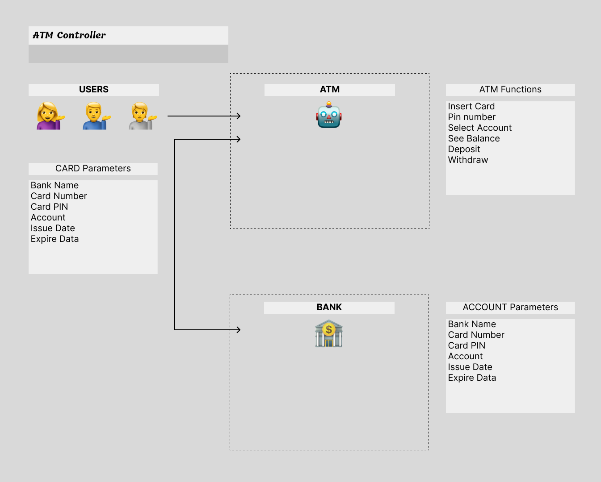

# ATM project

## Description
Implement functions, classes, methods for development of ATM machine.

## Minimum requirements
Insert Cards
PIN number
Select Account
See Balance
Deposit
Withdraw

## Considerations
The code might be integrated with bank system in the future
The code might be integrates with cash bin in the ATM
Keep in mind that UI can be implemented by another engineer in the future

## Tests
Add tests for controller logic

